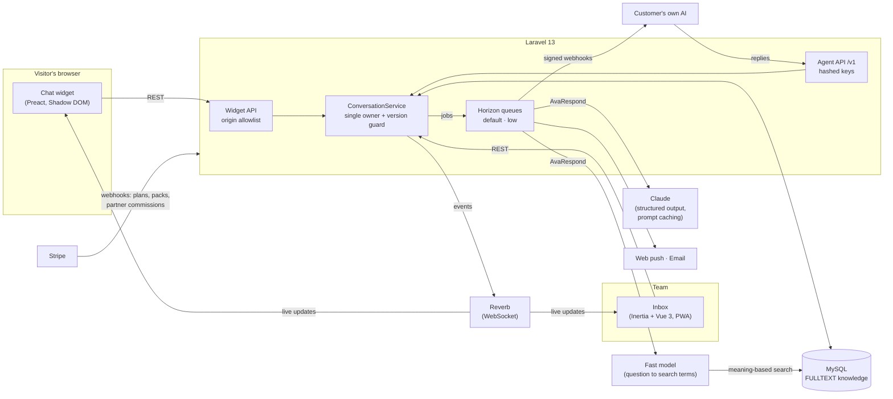

<p align="center">
  
</p>

<h1 align="center">Chattiv: Case Study</h1>

<p align="center">
  <b>Live chat for small business websites, with an AI assistant that knows when to step aside.</b><br>
  Laravel 13 · PHP 8.3 · MySQL · Redis + Horizon · Reverb · Claude · Stripe · Vue 3 · Preact
</p>

---

Most website chat tools fail small businesses in one of two ways: the chat goes unanswered, or a bot traps the
visitor in a loop with no way to reach a person. Chattiv is built around the opposite promise. People answer by
default. The AI assistant is optional, answers only from the business's own content, always says it is an AI, and
hands the conversation to a human the moment one is needed, with a summary so the visitor never repeats themselves.

This repository is a **portfolio case study**: a public overview of the product, architecture and engineering. The
full application source is private and available to reviewers on request.

> **Status:** live in production at [chattiv.com](https://chattiv.com), running chat on its own site and on
> several other SaaS products in the same portfolio.

---

## The product

<p align="center">
  
</p>

| | |
|---|---|
| **Chat widget** | One script tag. About 13 KB, isolated in a Shadow DOM, loads after the host page is idle. Brand color, greeting, offline form, file sharing, ratings, transcript by email. |
| **WordPress plugin** | Install from WordPress, click Connect to Chattiv, sign in, pick the website, and the chat is live. No code to copy. |
| **Team inbox** | Real-time inbox with views (waiting, mine, AI, unread), take over and hand back, private notes, canned replies, live visitor details, light and dark mode. Installable as a phone app with push alerts. |
| **Ava, the AI assistant** | Opt-in per website: off, human first with AI backup, AI after hours, or AI first. Learns from the site, a business brief, FAQ answers and documents, and from the questions she could not answer. Finds answers by meaning, not just matching words. |
| **Agent API** | Businesses can connect their own AI. It can answer chats directly under exactly the same handoff rules, or act as **Ava's helper**: teaching her and answering live when she doesn't know. Webhooks, WebSocket or simple polling. |
| **Billing** | Free, Starter and Pro plans with Stripe, a 25-chat Ava trial on Free and Starter so every new business meets the AI before paying for it, plus AI chat packs that never expire and an optional auto top-up with a monthly cap. |
| **Partner referrals** | Chattiv plugs into the shared SPM Partners program, where people who don't use it can promote it alongside the other products. Chattiv tracks their links and reports sign-ups and payments; the hub handles applications, commissions and payouts. |
| **Help center** | One set of articles shown in the app, on the public site, and used by Ava to answer customers' "how do I" questions. |

<p align="center">
  
</p>

---

## Architecture



One Laravel application serves the marketing site, the app, the Agent API and the widget API on separate hosts.
Laravel Reverb pushes every change to the inbox and the widget in real time. Horizon runs two queues so a long website
crawl can never delay a chat reply.

---

## Engineering highlights

### 1. One owner per conversation, enforced on the server

The core rule of the product is that the AI and a person never talk over each other. Every conversation has exactly
one owner (`ai`, `waiting`, `human`, `team`), and every transition goes through one service that bumps a version
number. A reply from the AI that arrives after a person took over is rejected rather than shown.

```php
// Simplified: a transition only succeeds against the version the caller saw.
$updated = Conversation::whereKey($c->id)
    ->where('owner_version', $c->owner_version)
    ->update(['owner' => $to, 'owner_version' => $c->owner_version + 1]);

if (! $updated) {
    throw new OwnershipConflict();   // someone else moved first
}
```

The handoff triggers are deliberately conservative: the visitor asks for a person (an always-visible button, or plain
words like "real person"), mentions a topic the business marked as human-only, gets two answers the AI could not
ground in the business's content, or the AI errors or misses a 30-second deadline. While the visitor waits, the AI
keeps helping, clearly labeled, and the team receives a short summary with a mood tag.

### 2. An AI that is honest by construction

Ava runs on Claude with **structured output**: every turn returns a JSON object (`reply`, `grounded`, `handoff`,
`summary`, `mood`, `contact`) rather than free text, so the application, not the model, decides what happens next.

- **Grounding.** Each turn retrieves the most relevant passages from that website's own knowledge (crawled pages, FAQ
  answers, documents) with MySQL FULLTEXT. The model must flag answers it could not support; two ungrounded answers
  hand the chat to a person.
- **Search by meaning.** Plain keyword search failed in a telling way: a visitor asked "what makes your service better than other services?", and the word "service" pulled five chunks of the Terms of Service while the site's comparison articles never surfaced. Now a fast, cheap model first rewrites each question into what the visitor means ("comparison, alternative, versus, competitors"), legal and template pages are demoted unless the question is about them, and no single page may take more than two of the eight slots. Replaying the same question afterwards returned the DocuSign and SignNow comparison pages and a grounded answer.
- **A business brief.** A short company overview rides in the cached part of the prompt on every turn, so broad questions ("what do you do?", "why you?") never depend on search at all.
- **Ava interviews the owner.** After each crawl, one call reviews everything Ava knows about the business, drafts that brief, and lists the questions customers of that kind of business usually ask that the site never answers (service area, warranties, cancellations, integrations). The owner answers them on a checklist, or a connected helper AI answers them through the API. On its first run across five live sites it found 12 to 15 real gaps each in about 20 seconds. Guesses inferred from the site are shown as guesses, never saved as answers until a person confirms them.
- **A learning loop without training.** Ungrounded questions are collected per website. The owner types an answer
  once, it becomes knowledge, and it is used on the very next message.
- **Locked disclosure.** The AI badge and "I'm an AI assistant" behavior are outside the business's control.
- **Cost control.** The stable part of the prompt (persona, rules, business profile) is prompt-cached; only the
  transcript and retrieved knowledge change per turn. Usage is metered per account per month with a hard cap.

### 3. A widget that is a good guest

The widget is the only code Chattiv runs on someone else's website, so it is built to be invisible until wanted:

- Preact and TypeScript bundled by esbuild into one file of about 13 KB gzipped, loaded only after the host page has
  finished and the browser is idle.
- Rendered inside a Shadow DOM so the host's CSS cannot break it and it cannot break the host.
- A minimal hand-written Pusher-protocol client for real-time updates instead of a client library.
- Every request is checked against the website's allowed domains, so a copied snippet does not work elsewhere.

Since roughly four in ten websites run WordPress, the widget also ships as a **WordPress plugin** with a one-click
connect instead of a snippet:

- The plugin sends the owner to Chattiv with its address and a one-time state token. Chattiv accepts the request only
  if the return address is the same site's `wp-admin`, so the flow can't be used as an open redirect. The owner signs
  in (new users onboard with the form already filled in), picks or creates the website, and is sent back with the
  site's public key. The plugin checks the state before saving anything.
- Chattiv adds the WordPress address to the website's allowed domains during that round trip, so the chat works the
  moment the owner lands back in WordPress, and the settings page asks Chattiv whether the chat is allowed on the
  site to catch misconfiguration.
- On the front end it is one async script tag through WordPress's own enqueue API, with options to hide the chat by
  content type or page and, opt-in only, to pass a signed-in user's name and email.
- It was tested in a real WordPress 7.1 running in the browser (WordPress Playground, installed straight from the
  app's download link) and passes WordPress.org's official Plugin Check with no errors.

### 4. Bring your own AI, same rules

The Agent API lets a business plug in any AI. Keys are stored hashed and shown once. Webhooks are signed with
HMAC-SHA256 over the timestamp and body, retried with backoff, and logged with response codes so developers can
debug without asking support. External agents get a 30-second reply deadline, after which the chat falls back to
the team automatically.

```text
X-Chattiv-Signature: sha256=<hex HMAC-SHA256(secret, "{timestamp}.{raw body}")>
```

Webhook targets and crawl URLs are validated against private and reserved networks to prevent server-side request
forgery.

The first real integration taught a lesson: many businesses already have an AI that knows them well, but it was
built for email, not for replying in a live chat within seconds. So the API gained a second role. A connected AI can
be **Ava's helper** instead of the voice on the chat: it receives every question Ava couldn't answer and its answers
become her knowledge, it can write the business brief and sync FAQ entries idempotently by its own ids, and,
optionally, Ava can ask it live ("let me check on that for you") with a wait window of up to three minutes before
falling back to a person. An AI without a public endpoint can do all of this by polling, no tunnel required.

### 5. Never miss a chat

Chattiv treats "nobody answered" as a design problem, not an edge case:

- Web push (VAPID) to an installable PWA, so alerts reach phones even when the inbox is closed, plus an in-app
  doorbell sound for the moments that matter.
- A configurable wait window. If nobody answers in time, the AI covers (when enabled) or the visitor is offered an
  email follow-up, and the team's reply is emailed to them, branded as the business.
- Time zones handled end to end: stored in UTC, shown in the reader's own zone, with business hours evaluated in
  each website's zone.

### 6. Billing that cannot surprise anyone

Stripe through Laravel Cashier, attached to the account rather than the user so a team shares one subscription.
AI usage is the only metered cost, so it has a hard monthly cap. Extra AI chat packs never expire, and optional auto
top-up runs only within a monthly spending limit the owner sets, pausing itself if a payment fails.

### 7. Deleting data properly

Privacy promises are only as good as the delete button behind them, so both kinds of deletion are real features
rather than support tickets:

- **A visitor's data** ("please delete my information", for example under GDPR): an owner or admin removes the
  visitor from Contacts or from the chat, and every conversation, message, page view and contact detail goes with
  them. Files they sent are removed from disk too, not just unlinked in the database.
- **A whole business account**: the owner types the account name and their password in a Danger zone. Billing is
  cancelled first, and if Stripe can't cancel, nothing is deleted, so nobody can keep paying for an account that no
  longer exists. Then one transaction removes the account, and foreign-key cascades take every website, chat,
  contact, knowledge source, AI agent, API key and team membership with it, followed by the files on disk. Nightly
  backups age out within 14 days, which is exactly what the privacy policy and DPA say.

### 8. Plugging into a shared partner program

Chattiv's referral program started as a self-contained feature inside the app. Once SocialPoints Media had several
products with referral programs, it moved to one shared hub (one partner account, one agreement, one payout across
every product), and Chattiv became a client of that hub. The product kept only what it is best placed to do:

- **Attribution.** `?ref=code` on any page, or a `chattiv.com/r/code` short link, is remembered for 90 days in a cookie
  scoped to the parent domain, so a click on the marketing site is still known when the visitor signs up on the app
  host. The last link clicked wins, and the code is credited to the business account at onboarding.
- **Money events, reported from Stripe.** A listener on the Stripe webhook turns every charge on a referred account
  into a `payment` event for the hub (plans and AI packs alike), `charge.refunded` into a `refund` for only the newly
  refunded part, and disputes into a `chargeback` that points at the charge it undoes. Customers of other apps on the
  shared Stripe account are ignored.
- **Safe delivery.** Each event carries a stable external id (`charge:{id}`, `refund:{id}:{running total}`), so the hub
  can de-duplicate and a queued job can retry freely; malformed events are dropped instead of retried forever. A
  partner-program outage can never make Stripe re-deliver a webhook or slow down the app.

---

## More of the product

<p align="center">
  
</p>

<p align="center">
  
</p>

<p align="center">
  
</p>

<p align="center">
  
</p>

---

## Quality and safety

- A feature test suite of 170+ tests covering ownership and handoff, AI escalation, helper agents, knowledge search
  ranking, the offline path, widget origin checks, the Agent API and webhook signing, plan limits, billing and
  top-ups, data deletion, the knowledge gap check, partner attribution and reporting, emails, time zones and the help center.
- The test bootstrap refuses to run against anything but an in-memory database, so a test run can never touch
  production data.
- Continuous integration on every push: GitHub Actions installs from the lock file with strict `npm ci` on the same
  Node version as production, builds the app and the widget, and runs the full suite. Wiring it up surfaced a real
  packaging bug (an export rule that silently dropped the branded email templates), which is the point of having it.
- Dependencies are audited and kept clean. The only advisories ever reported were in build-time tooling (a formatter's
  worker pool and a dev process runner), never in code that reaches the browser or the server runtime; they were
  patched anyway, and `npm audit` reports zero.
- Accessibility and performance by default: keyboard support in the widget, reduced-motion support, and no work on
  the host page until it has loaded.

## Tech stack

**Backend:** PHP 8.3, Laravel 13, MySQL 8, Redis, Horizon, Reverb, Cashier (Stripe), Fortify (2FA and passkeys),
Anthropic PHP SDK (Claude).
**Frontend:** Inertia 3, Vue 3, TypeScript, Tailwind CSS. **Widget:** Preact, TypeScript, esbuild.

---

<p align="center">
  Chattiv is a product of SocialPoints Media LLC. Source available to reviewers on request.
</p>
